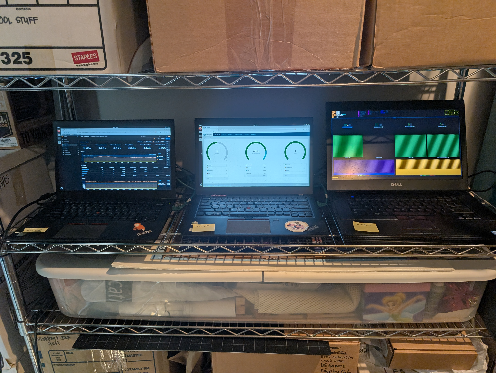

# K3s Home Lab

This repository tracks the setup and configuration for my K3s home lab.

## Hardware

The lab consists of three laptops:
*   Two Lenovo T460s (my kids' old laptops)
*   One Dell E6510

All three machines are running Ubuntu 24.04 and are part of a K3s cluster.

## Current Status

The laptops are currently used as dedicated displays for monitoring the cluster:
*   **Lenovo T460 #1:** Displays Grafana dashboards for cluster health.
*   **Lenovo T460 #2:** Displays the Longhorn dashboard for storage monitoring.
*   **Dell E6510:** Runs the K9s 'pulse' view for real-time cluster activity.

## Plan

This project uses some of the plans outlined in [K3sPlan.md](K3sPlan.md) to track what is coming next.

